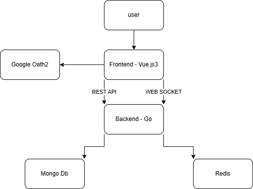

## Project Overview

This is a cinema ticket booking system.

## System Architecture Diagram



## Tech Stack Overview

- Backend: Go
- Frontend: React
- Database: MongoDB
- Cache: Redis
- Message Queue: Redis Pub/Sub
- Google OAuth2

## Booking Flow

1. User logs in with Google OAuth2
2. User selects a movie
3. User selects seats
4. User pays for the tickets
5. User receives tickets

## Redis Lock Strategy

- Use Redis to lock seats for a certain amount of time
- If the user doesn't pay within the time limit, the seats will be released
- Use Redis Pub/Sub to notify users of seat availability

## Message Queue Strategy

- Use Redis Pub/Sub to notify users of seat availability

## How to run

- Set up Google OAuth2 credentials on frontend and backend .env file
- Set up MongoDB url on backend .env file
- Set up Redis url on backend .env file
- Use docker-compose to run the application

```bash
docker-compose up --build
```